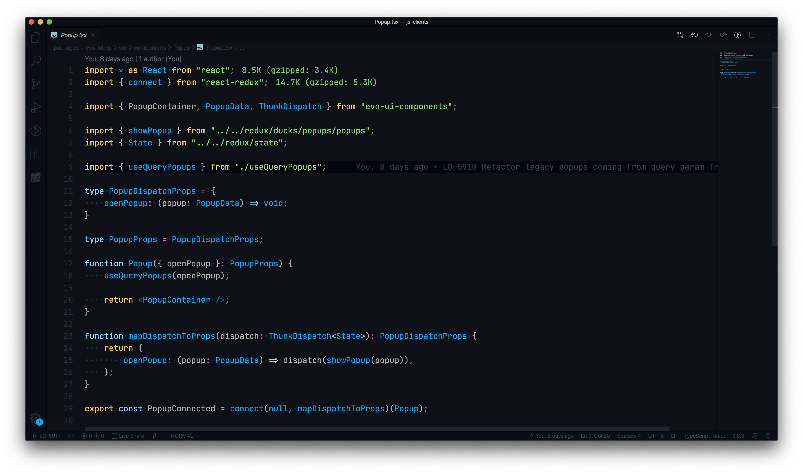
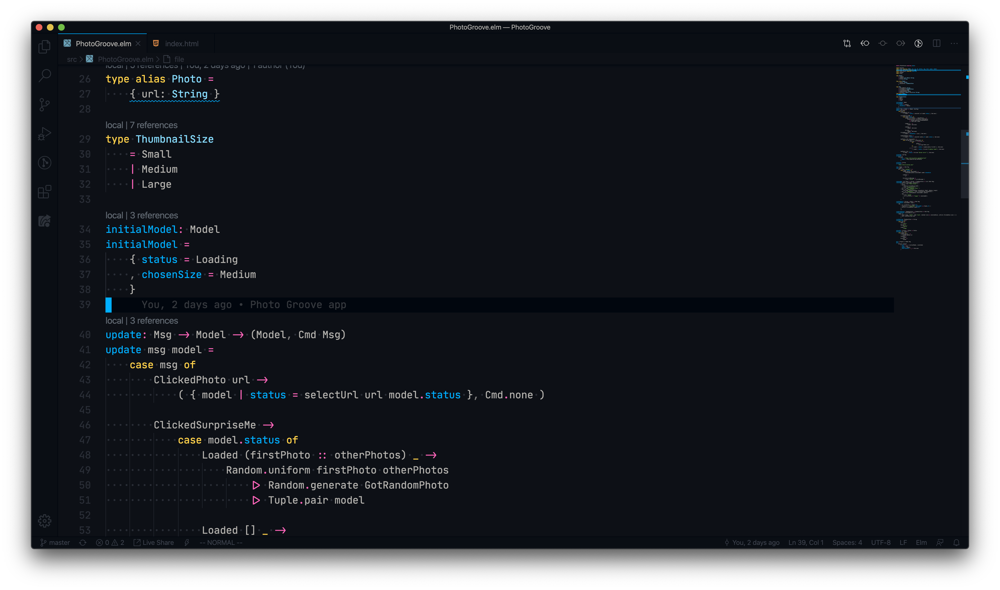

# Azure Dark Color Theme

> Theme inspired by Framer Syntax and Ayu Dark

### Feedback

Please share you feedback at [Github issues](https://github.com/usetheplatform/azure-dark/issues)

### Installation

Download the extension from https://marketplace.visualstudio.com/items?itemName=usetheplatform.azure-dark and follow the instructions

> You can also just grab the whole directory and put it at ~/.vscode/extensions or ~/.vscode-insiders/extensions

### Preview

#### JavaScript

#### React

#### Elm

